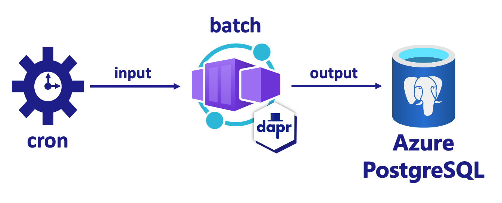

# Dapr Bindings (Dapr SDK)

In this quickstart, you'll create a microservice to demonstrate Dapr's bindings API to work with external systems as inputs and outputs. The service listens to input binding events from a system cron job and then outputs the contents of local data to a PostgreSQL output binding.



Visit [this](https://docs.dapr.io/developing-applications/building-blocks/bindings/) link for more information about Dapr and Bindings.

# Run and develop locally

### Run and initialize PostgreSQL container

1. Open a new terminal, change directories to `../../db`, and run the container with [Docker Compose](https://docs.docker.com/compose/): 

<!-- STEP
name: Run and initialize PostgreSQL container
expected_return_code:
background: true
sleep: 5
timeout_seconds: 6
-->

```bash
cd db/
docker compose up -d
```

<!-- END_STEP -->

### Run Javascript service with Dapr

2. Open a new terminal window, change directories to `./batch` in the quickstart directory and run: 

<!-- STEP
name: Install Javascript dependencies
-->

```bash
cd ../batch
npm install
```

<!-- END_STEP -->
3. Run the Javascript service app with Dapr: 

<!-- STEP
name: Run batch-sdk service
working_dir: ./batch
expected_stdout_lines:
  - '== APP == insert into orders (orderid, customer, price) values (1, ''John Smith'', 100.32)'
  - '== APP == insert into orders (orderid, customer, price) values (2, ''Jane Bond'', 15.4)'
  - '== APP == insert into orders (orderid, customer, price) values (3, ''Tony James'', 35.56)'
  - '== APP == Finished processing batch'
expected_stderr_lines:
output_match_mode: substring
sleep: 11
timeout_seconds: 30
-->
    
```bash
dapr run --app-id batch-sdk --app-port 5002 --dapr-http-port 3500 --components-path ../components -- node index.js
```
<!-- END_STEP -->

4. Expected output:
A batch script runs every 10 seconds using an input Cron binding. The script processes a JSON file and outputs data to a SQL database using the PostgreSQL Dapr binding:

```bash
== APP == {"sql": "insert into orders (orderid, customer, price) values (1, 'John Smith', 100.32);"}
== APP == {"sql": "insert into orders (orderid, customer, price) values (2, 'Jane Bond', 15.4);"}
== APP == {"sql": "insert into orders (orderid, customer, price) values (3, 'Tony James', 35.56);"}
== APP == Finished processing batch
== APP == {"sql": "insert into orders (orderid, customer, price) values (1, 'John Smith', 100.32);"}
== APP == {"sql": "insert into orders (orderid, customer, price) values (2, 'Jane Bond', 15.4);"}
== APP == {"sql": "insert into orders (orderid, customer, price) values (3, 'Tony James', 35.56);"}
== APP == Finished processing batch
== APP == {"sql": "insert into orders (orderid, customer, price) values (1, 'John Smith', 100.32);"}
== APP == {"sql": "insert into orders (orderid, customer, price) values (2, 'Jane Bond', 15.4);"}
== APP == {"sql": "insert into orders (orderid, customer, price) values (3, 'Tony James', 35.56);"}
== APP == Finished processing batch
```

5. Stop postgres container 

```bash
cd ../db
docker compose stop
```

# Deploy to Azure (Azure Container Apps and Azure PostgreSQL)

> NOTE: make sure you have Azure Developer CLI pre-reqs [here](https://learn.microsoft.com/azure/developer/azure-developer-cli/install-azd)

1. Set environment variable for PostgreSQL password:
```bash
azd env set POSTGRES_PASSWORD <PASSWORD>
```

2. Provision infrastructure and deploy application:
```bash
azd up
```

3. Confirm the deployment is successful:

Navigate to the Container App resource for the Batch service. Locate the `Log stream` and confirm the batch container is logging each insert successfully every 10s. 


